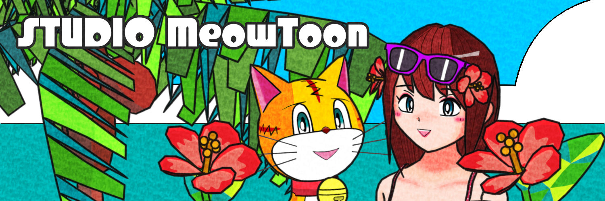

  <ul align="left" style="list-style: none">
    

      <h1>
        Hi there, I'm hiroxpepe 👋
      </h1>
    

  </ul>

**<h3 align="left">Connect with me:</h3>** 

 

**<h3 align="left">🎮✨ I'm a versatile indie developer, creating original mobile games with my own IP and developing a music composition app as STUDIO MeowToon. 🎶🎹</h3>**

**<h3 align="left">Rapid Fire</h3>**

- 💼 I'm currently working on: 🎮 Developing mobile games as an indie developer with Unity.

 **<h3 align="left">GitHub Stats</h3>**

  

  

